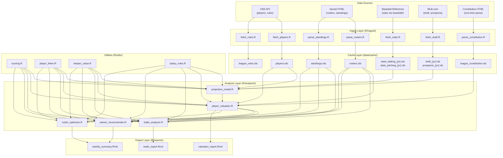
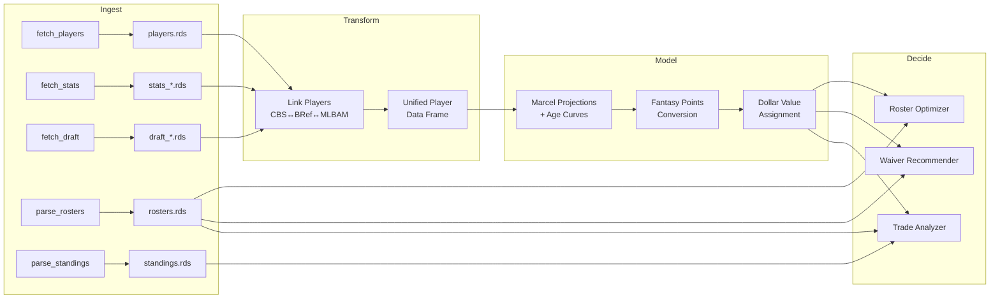

# Design Document: Fantasy Baseball Decision Helper

## Overview

The Fantasy Baseball Decision Helper is an R analytics platform that transforms raw league data and public baseball statistics into actionable decision support for the La-Z-Boyz of Summer keeper league. The system follows a layered pipeline architecture: **Ingest → Transform → Model → Decide → Report**.

The platform operates as a collection of R scripts and functions organized into modules, with RDS files serving as the inter-module data contract. There is no server or web framework — the user interacts with the system through Kiro (AI assistant) chat, which executes R scripts, interprets results, and presents analysis in conversational format. The user's workflow is:

1. Save updated HTML pages from CBS into `data/imports/` when fresh data is needed
2. Ask Kiro for analysis (e.g., "Should I accept this trade?" or "Who should I target on waivers?")
3. Kiro runs the appropriate R scripts, interprets the output, and presents recommendations with reasoning

Key design decisions:
- **R-native throughout**: leverages R's statistical modeling ecosystem ({tidymodels}, {mgcv}) and baseball-specific packages ({baseballr})
- **File-based caching**: RDS files in `data/cache/` serve as the integration layer between modules, enabling incremental refresh and offline operation
- **Hybrid data sourcing**: unauthenticated CBS API for player/rules data, browser-saved HTML for roster/standings, Baseball Reference for performance stats
- **League-specific valuation**: all models are parameterized by the league's exact H2H Points scoring weights, salary structure, and roster construction

## Architecture



### Module Dependency Flow

1. **Ingest** → produces cached RDS files (no inter-module dependencies)
2. **Utilities** → pure functions used by all analysis modules (scoring math, player matching, salary rules)
3. **Projection Model** → consumes cached stats + player data, produces projections
4. **Player Valuation** → consumes projections + league context, produces dollar values
5. **Decision Modules** (Trade Analyzer, Waiver Recommender, Roster Optimizer) → consume valuations + roster/standings context
6. **Reports** → render analysis results into human-readable output

## Components and Interfaces

### R/utils/scoring.R

Pure functions for computing H2H Points from stat lines.

```r
#' Compute batting fantasy points from a stat line
#' @param stats Named list or 1-row data.frame with batting stats
#' @param weights League scoring weights (from constitution$scoring$batting)
#' @return Numeric: total fantasy points
compute_batting_points <- function(stats, weights = NULL)

#' Compute pitching fantasy points from a stat line
#' @param stats Named list or 1-row data.frame with pitching stats
#' @param weights League scoring weights (from constitution$scoring$pitching)
#' @return Numeric: total fantasy points
compute_pitching_points <- function(stats, weights = NULL)

#' Convert season stats to points-per-week
#' @param total_points Total fantasy points for the season
#' @param games_played Games played so far
#' @param games_per_week Average games per week (default 6.5 for batters, varies for pitchers)
#' @return Numeric: projected points per week
points_per_week <- function(total_points, games_played, games_per_week = 6.5)
```

### R/utils/player_linker.R

Crosswalk between CBS player IDs, Baseball Reference names, and MLBAM IDs.

```r
#' Link CBS roster players to Baseball Reference stats
#' @param roster_df Data frame from rosters.rds
#' @param stats_df Data frame from stats_batting or stats_pitching .rds
#' @return roster_df augmented with matched stat columns
link_roster_to_stats <- function(roster_df, stats_df)

#' Fuzzy match player names between sources
#' @param name_a Character vector of names from source A
#' @param name_b Character vector of names from source B
#' @param team_a MLB team abbreviations for source A
#' @param team_b MLB team abbreviations for source B
#' @return Data frame with matched indices and confidence score
fuzzy_match_players <- function(name_a, name_b, team_a = NULL, team_b = NULL)

#' Look up MLBAM ID for a player
#' @param player_name Full player name
#' @return Integer MLBAM ID or NA
get_mlbam_id <- function(player_name)
```

### R/utils/keeper_value.R

Keeper salary projection and multi-year value calculations.

```r
#' Project keeper salary over N years
#' @param current_salary Current salary (numeric)
#' @param is_minor_contract Logical: is this a minor league contract (asterisk)?
#' @param minor_track_year Integer 0-3: current year in minor league track
#' @param years_ahead Integer: how many years to project
#' @return Numeric vector of projected salaries for each future year
project_keeper_salary <- function(current_salary, is_minor_contract = FALSE,
                                   minor_track_year = 0, years_ahead = 5)

#' Compute multi-year surplus value for keeper analysis
#' @param projected_values Numeric vector of projected dollar values per year
#' @param projected_salaries Numeric vector of projected salaries per year
#' @param discount_rate Annual discount rate for future value (default 0.9)
#' @return List with: annual_surplus, total_surplus, npv_surplus
compute_keeper_surplus <- function(projected_values, projected_salaries,
                                    discount_rate = 0.9)
```

### R/utils/salary_rules.R

Salary cap validation and constraint checking.

```r
#' Check if a roster is salary-cap compliant
#' @param roster_df Team roster data frame with salary column
#' @param cap_type One of "auction" (260), "in_season" (300), "keeper" (80)
#' @return List with: compliant (logical), total_salary, remaining_cap
check_salary_cap <- function(roster_df, cap_type = "in_season")

#' Compute salary impact of a transaction
#' @param players_in Players being added (with salaries)
#' @param players_out Players being removed (with salaries)
#' @param current_total Current team salary total
#' @return List with: net_change, new_total, cap_compliant
compute_salary_impact <- function(players_in, players_out, current_total)
```

### R/analysis/projection_model.R

Statistical projection engine using historical data and current performance.

```r
#' Generate rest-of-season projections for all players
#' @param current_stats Current season stats (from cache)
#' @param historical List of prior-year stats data frames
#' @param player_info Player database with age, position, etc.
#' @return Data frame with projected stats for each player
generate_projections <- function(current_stats, historical, player_info)

#' Marcel-style weighted projection
#' @param seasons List of season stat lines for one player (most recent first)
#' @param weights Numeric vector of season weights (default c(5, 4, 3))
#' @param regression_pct Percent regression to mean (by stat category)
#' @return Named numeric vector of projected stats
marcel_project <- function(seasons, weights = c(5, 4, 3), regression_pct = NULL)

#' Age-curve adjustment
#' @param projected_stats Base projection
#' @param age Player's current age
#' @param position Player position (aging curves differ by position)
#' @return Adjusted projected stats
apply_age_curve <- function(projected_stats, age, position)

#' Convert projected stats to projected H2H Points per week
#' @param projections Data frame of projected stats
#' @param scoring_weights League scoring weights
#' @return projections augmented with pts_per_week column
project_fantasy_points <- function(projections, scoring_weights)
```

### R/analysis/player_valuation.R

Dollar value assignment based on league economics.

```r
#' Compute replacement level by position
#' @param projections All player projections with position info
#' @param roster_slots Named vector of slots per position × 16 teams
#' @return Named numeric vector: replacement-level pts/week per position
compute_replacement_level <- function(projections, roster_slots)

#' Assign dollar values to all projected players
#' @param projections Data frame with pts_per_week
#' @param replacement_levels Output from compute_replacement_level()
#' @param total_salary_pool Total $ to distribute (default: 260 × 16 = 4160)
#' @return Data frame with dollar_value, surplus_value columns
assign_dollar_values <- function(projections, replacement_levels,
                                  total_salary_pool = 4160)

#' Positional scarcity adjustment
#' @param values Data frame with initial dollar values
#' @param roster_slots Roster construction
#' @return Adjusted values with scarcity premium
adjust_positional_scarcity <- function(values, roster_slots)
```

### R/analysis/trade_analyzer.R

Multi-dimensional trade evaluation.

```r
#' Analyze a proposed trade
#' @param give Character vector of player names being traded away
#' @param receive Character vector of player names being received
#' @param my_team Character: owner's team name
#' @param valuations Current player valuations
#' @param rosters Full league roster data
#' @param standings Current standings
#' @return List with: summary, value_diff, salary_impact, keeper_analysis,
#'         positional_impact, recommendation
analyze_trade <- function(give, receive, my_team, valuations, rosters, standings)

#' Determine team competitive context
#' @param team_name Team name
#' @param standings Current standings data
#' @return List with: mode ("contend"|"rebuild"|"middle"), playoff_prob,
#'         games_back, division_rank
assess_competitive_context <- function(team_name, standings)
```

### R/analysis/waiver_recommender.R

FAAB bidding recommendations.

```r
#' Generate FAAB recommendations
#' @param my_team Owner's team name
#' @param valuations Current player valuations
#' @param rosters League roster data
#' @param remaining_faab Remaining FAAB budget
#' @param weeks_remaining Weeks left in regular season
#' @return List with: targets (top 10), drop_candidates, suggested_bids
recommend_faab <- function(my_team, valuations, rosters, remaining_faab, weeks_remaining)

#' Suggest FAAB bid amount
#' @param player_surplus Projected surplus value
#' @param remaining_budget Remaining FAAB budget
#' @param weeks_remaining Weeks left
#' @param competition_factor How many teams likely bidding (1-5 scale)
#' @return Numeric: suggested bid amount ($1 minimum)
suggest_bid <- function(player_surplus, remaining_budget, weeks_remaining,
                        competition_factor = 3)
```

### R/analysis/roster_optimizer.R

Weekly lineup optimization.

```r
#' Recommend optimal starting lineup for a scoring period
#' @param my_team Owner's team name
#' @param rosters Current roster data
#' @param projections Per-week player projections
#' @param injuries Current injury data from player database
#' @param matchup_context List with opponent strength info
#' @return Data frame: optimal lineup with slot assignments and projected points
optimize_lineup <- function(my_team, rosters, projections, injuries = NULL,
                            matchup_context = NULL)

#' Select optimal pitching staff for the week
#' @param available_pitchers Team's pitcher roster
#' @param projections Pitcher projections
#' @param schedule 2-start pitcher info for the week
#' @return Data frame: recommended 5 SP + 2 RP with rationale
optimize_pitchers <- function(available_pitchers, projections, schedule = NULL)
```

## Data Models

### Core Data Structures

All data is stored as R data frames (tibbles) in RDS format. The following describes the schema for each key dataset.

#### rosters.rds — League Roster Data

| Column | Type | Description |
|--------|------|-------------|
| team_name | character | Fantasy team name |
| player_type | character | "Batter" or "Pitcher" |
| roster_position | character | Slot on roster (C, 1B, SP, Reserve, etc.) |
| player_name | character | Full player name |
| eligible_positions | character | Comma-separated eligible positions |
| mlb_team | character | MLB team abbreviation |
| cbs_id | character | CBS player ID |
| salary_raw | character | Raw salary string (e.g., "$5", "$1*") |
| salary | numeric | Parsed salary amount |
| is_minor_contract | logical | TRUE if salary has asterisk |
| total_fpts | numeric | Season total fantasy points from CBS |

#### players.rds — CBS Player Database

| Column | Type | Description |
|--------|------|-------------|
| cbs_id | character | CBS player ID |
| fullname | character | Full player name |
| firstname | character | First name |
| lastname | character | Last name |
| position | character | Primary position |
| eligible_positions | character | Display string of eligible positions |
| mlb_team | character | MLB team abbreviation |
| pro_status | character | "A" (active), "M" (minors), "IL" (injured) |
| age | integer | Player age |
| bats | character | Batting hand (R/L/S) |
| throws | character | Throwing hand (R/L) |
| jersey | character | Jersey number |
| injury | character | Injury status text or NA |
| elias_id | character | Elias Sports Bureau ID |

#### standings.rds — League Standings

| Column | Type | Description |
|--------|------|-------------|
| division | character | Division name |
| team_name | character | Fantasy team name |
| wins | integer | Wins |
| losses | integer | Losses |
| ties | integer | Ties |
| pct | numeric | Winning percentage |
| games_back | numeric | Games behind division leader |
| streak | character | Current streak (e.g., "W3") |
| div_record | character | Division record |
| magic_number | character | Clinch number |
| total_points | numeric | Season total fantasy points |
| points_behind_leader | numeric | Points behind overall leader |
| points_against | numeric | Total opponent points |
| games_played | integer | Total games played (derived) |
| ppg | numeric | Points per game (derived) |

#### projections.rds — Player Projections (generated)

| Column | Type | Description |
|--------|------|-------------|
| player_name | character | Player name |
| cbs_id | character | CBS player ID |
| position | character | Primary position |
| player_type | character | "Batter" or "Pitcher" |
| proj_pts_per_week | numeric | Projected H2H Points per week |
| proj_pts_ros | numeric | Projected rest-of-season total points |
| confidence_lo | numeric | Lower bound (80% CI) pts/week |
| confidence_hi | numeric | Upper bound (80% CI) pts/week |
| proj_* | numeric | Individual projected stats (HR, SB, ERA, etc.) |
| data_quality | character | "full" (3+ yr), "limited" (<3 yr), "rookie" |
| model_version | character | Projection model version tag |

#### valuations.rds — Player Dollar Values (generated)

| Column | Type | Description |
|--------|------|-------------|
| player_name | character | Player name |
| cbs_id | character | CBS player ID |
| position | character | Primary position |
| dollar_value | numeric | Projected $ value based on league economics |
| salary | numeric | Current salary (NA if free agent) |
| surplus_value | numeric | dollar_value − salary |
| keeper_value_3yr | numeric | NPV of surplus over 3 years |
| keeper_value_5yr | numeric | NPV of surplus over 5 years |
| is_minor_contract | logical | Minor league contract flag |
| minor_track_year | integer | Year in minor salary track (0-3) |
| replacement_level | numeric | Replacement-level pts/week at position |
| pts_above_replacement | numeric | Projected pts/week above replacement |
| positional_scarcity | numeric | Scarcity multiplier for position |

#### league_constitution.rds — Structured League Rules

Stored as a nested R list (see `parse_constitution.R` for full structure). Key paths:
- `$scoring$batting` — H2H Points batting weights
- `$scoring$pitching` — H2H Points pitching weights
- `$salary$auction_cap` / `$salary$in_season_cap` / `$salary$keeper_cap`
- `$keepers$annual_increase` — +$4/year escalation
- `$minor_league$promotion_threshold_ab` / `$minor_league$promotion_threshold_ip`
- `$roster$positions` — Named list of position slots
- `$playoffs` — Playoff structure and seeding rules
- `$transactions$faab_process` — FAAB schedule

### Data Flow: From Ingest to Decision



### Projection Model Architecture

The projection model uses a **Modified Marcel** approach:

1. **Historical weighting**: Last 3 seasons weighted 5/4/3 (most recent heaviest)
2. **Playing time regression**: Regress counting stats toward league average based on sample size
3. **Age curve**: Position-specific aging adjustments (peak at 27 for batters, 28 for pitchers)
4. **Injury discount**: Reduce projected playing time based on IL history
5. **Statcast quality adjustments** (when available): xBA, xSLG, barrel rate for hitters; stuff metrics for pitchers

The model is implemented in {tidymodels} for the regression components and base R for the Marcel-style weighted averaging. This avoids over-engineering while being extensible to more sophisticated approaches later.

### Valuation Economics

Dollar values are computed using a **marginal value over replacement** approach:

1. Define replacement level at each position: the (N+1)th best player where N = slots × 16 teams
2. Compute Points Above Replacement (PAR) for each player
3. Sum total PAR across all above-replacement players
4. Distribute the total salary pool ($260 × 16 = $4,160) proportional to PAR share
5. Apply positional scarcity multiplier for thin positions (C, SS get premium)


## Correctness Properties

*A property is a characteristic or behavior that should hold true across all valid executions of a system — essentially, a formal statement about what the system should do. Properties serve as the bridge between human-readable specifications and machine-verifiable correctness guarantees.*

### Property 1: RDS Serialization Round-Trip

*For any* R object (data frame, list, or nested structure) with metadata attributes, saving it via `saveRDS()` and reading it back via `readRDS()` shall produce an object identical to the original, including all column types, row values, and custom attributes (source_file, parsed_at, league_id).

**Validates: Requirements 1.5, 9.1**

### Property 2: CSV Export Round-Trip

*For any* data frame containing text columns with UTF-8 characters (including accented names like "José Ramírez"), exporting to CSV with `write.csv(fileEncoding = "UTF-8")` and reading back with `read.csv(fileEncoding = "UTF-8")` shall preserve all character values exactly.

**Validates: Requirements 9.3**

### Property 3: Constitution Validation Completeness

*For any* valid league constitution R list containing all required fields, the validation function shall return TRUE. *For any* constitution with one or more required fields removed, the validation function shall return FALSE and identify the missing field(s).

**Validates: Requirements 2.10**

### Property 4: Player Fuzzy Matching Correctness

*For any* player present in both the CBS roster database and Baseball Reference stats (with matching MLB team), the fuzzy matching function shall produce a successful link with confidence ≥ 0.8, regardless of minor name variations (suffixes like "Jr."/"III", accent marks, or abbreviated first names).

**Validates: Requirements 3.5**

### Property 5: Scoring Computation Correctness

*For any* valid batting stat line, `compute_batting_points(stats, weights)` shall equal the sum of each stat multiplied by its corresponding weight (1B×1 + 2B×2 + 3B×3 + HR×4 + R×1 + RBI×1 + BB×1 + HBP×1 + SB×2 + CS×(-1) + K×(-0.5) + grand_slams×2 + cycles×5). The same additive property holds for pitching points.

**Validates: Requirements 4.6, 5.1**

### Property 6: Projection Recency Weighting

*For any* player with 3 seasons of historical data where the most recent season's stat value differs from the oldest by more than 20%, the projection shall be closer to the most recent season's value than to the oldest season's value.

**Validates: Requirements 4.2**

### Property 7: Age Curve Monotonicity

*For any* identical stat line, applying the age curve adjustment for a player aged 35 shall produce lower projected counting stats than applying it for a player aged 27 (peak age), for both batters and pitchers.

**Validates: Requirements 4.4**

### Property 8: Confidence Interval Invariant

*For any* player projection, the confidence bounds shall satisfy: `confidence_lo ≤ proj_pts_per_week ≤ confidence_hi`, and both bounds shall be non-negative.

**Validates: Requirements 4.7**

### Property 9: Confidence Width vs Data Availability

*For any* player, a projection generated with 1 season of historical data shall have a wider confidence interval (confidence_hi − confidence_lo) than the same player's projection generated with 3 seasons of historical data.

**Validates: Requirements 4.3**

### Property 10: Dollar Value Conservation

*For any* set of player projections with defined replacement levels, the sum of all positive dollar values assigned by `assign_dollar_values()` shall equal the total salary pool ($4,160 ± rounding tolerance of $1).

**Validates: Requirements 5.2**

### Property 11: Replacement Level Definition

*For any* position with N roster slots across 16 teams, the computed replacement level shall equal the projected points-per-week of the (N×16 + 1)th ranked player at that position.

**Validates: Requirements 5.3**

### Property 12: Positional Scarcity Premium

*For any* two players at different positions with identical points-above-replacement, the player at the scarcer position (fewer total league slots) shall receive a higher or equal dollar value after scarcity adjustment.

**Validates: Requirements 5.4**

### Property 13: Keeper Salary Projection

*For any* player with a current salary S on a standard contract, the projected salary in year N shall equal S + (4 × N). *For any* player on a minor league contract at track year Y (0–3), the salary shall follow: year 0→$0, year 1→$1, year 2→$2, year 3→$3, year 4+→$3 + $4×(years beyond year 3). Keeper surplus for year N shall equal (projected_value_N − projected_salary_N) × discount_rate^N.

**Validates: Requirements 5.6, 5.7, 6.4**

### Property 14: Trade Arithmetic Correctness

*For any* trade proposal with players A₁..Aₙ traded away (with known surplus values S_A and points-per-week P_A and salaries $A) and players B₁..Bₘ received, the trade analysis shall report: (a) net surplus = Σ(S_B) − Σ(S_A), (b) points change = Σ(P_B) − Σ(P_A), (c) salary change = Σ($B) − Σ($A), and (d) cap_compliant = (current_total + salary_change ≤ 300).

**Validates: Requirements 6.1, 6.2, 6.3**

### Property 15: Trade Lopsided Detection

*For any* trade where |net_surplus_difference| > 0.20 × (Σ|value_give| + Σ|value_receive|), the trade analyzer shall flag the trade as lopsided. *For any* trade where this ratio is ≤ 0.20, it shall not be flagged.

**Validates: Requirements 6.9**

### Property 16: Waiver Recommendations Sorted by Surplus

*For any* set of available free agents, the FAAB recommendation list shall be sorted in descending order of projected surplus value, containing at most 10 entries. *For any* owner's roster, the drop candidates list shall be sorted in ascending order of projected surplus value.

**Validates: Requirements 7.1, 7.2**

### Property 17: FAAB Bid Bounds and Monotonicity

*For any* recommended FAAB bid, the suggested amount shall be ≥ $1 (league minimum) and ≤ remaining_budget. *For any* two players where player A has strictly higher surplus value than player B (with all other factors equal), the suggested bid for A shall be ≥ the suggested bid for B.

**Validates: Requirements 7.3**

### Property 18: Recommendation Constraint Compliance

*For any* waiver recommendation, the recommended player must have position eligibility for at least one fillable roster slot, and adding the player (at their salary) must keep total team salary ≤ $300. *For any* team classified as non-contender during playoff weeks, the FAAB recommendation list shall be empty.

**Validates: Requirements 7.4, 7.8**

### Property 19: Lineup Validity

*For any* valid team roster, the optimized lineup shall: (a) fill exactly 16 active slots (1C, 1×1B, 1×2B, 1×3B, 1×SS, 3×OF, 1×U, 5×SP, 2×RP), (b) assign each player to at most one slot, (c) only assign players to positions for which they are eligible, and (d) not include any player with an active injury (IL/DTD) status.

**Validates: Requirements 8.1, 8.2**

### Property 20: Two-Start Pitcher Preference

*For any* two starting pitchers on the same roster where pitcher A has 2 scheduled starts and pitcher B has 1 start, and A's per-start quality (projected points per start) is within 80% of B's, the lineup optimizer shall prefer pitcher A for an active SP slot.

**Validates: Requirements 8.5**

### Property 21: Minor League Promotion Threshold Flagging

*For any* player on a minor league contract, if their current AB ≥ 110 or IP ≥ 40, the system shall flag them as "approaching promotion threshold." If AB < 110 and IP < 40, they shall not be flagged.

**Validates: Requirements 7.6**

## Error Handling

### Data Source Failures

| Scenario | Behavior |
|----------|----------|
| CBS API timeout (>60s) | Log error with timestamp, return cached RDS if available, warn user of cache age |
| CBS API HTTP error (4xx/5xx) | Same as timeout: log, fallback to cache, warn |
| Baseball Reference rate limiting | Retry with exponential backoff (2s, 4s, 8s), max 3 retries, then fallback to cache |
| FanGraphs 403 | Silent fallback to Baseball Reference, no error displayed |
| Missing HTML import file | Display step-by-step instructions with exact URL and file path |
| Malformed HTML (changed CBS layout) | Parse as much as possible, warn about missing fields, return partial data |

### Model Failures

| Scenario | Behavior |
|----------|----------|
| Player has no historical stats | Exclude from projections, mark as "data_quality = no_data" |
| Player has < 1 season of stats | Generate projection with "rookie" confidence (extra-wide CI) |
| Projection produces negative counting stats | Floor at zero, log warning |
| Division by zero in per-week calculation | Return NA with warning (e.g., 0 games played) |

### Decision Module Failures

| Scenario | Behavior |
|----------|----------|
| Trade contains unknown player | Reject trade with "player not found" error, list unresolved names |
| No eligible replacement for injured player | Notify owner, identify affected slot |
| Salary cap violation in recommendation | Exclude recommendation, suggest alternative within cap |
| No beneficial FAAB moves available | Return empty list with explanatory message |
| Lineup infeasible (not enough eligible players) | Fill as many slots as possible, warn about unfilled slots |

### Serialization Failures

| Scenario | Behavior |
|----------|----------|
| Disk full or write permission error | Log error, retain in-memory results, suggest manual save path |
| Corrupted RDS file on read | Warn user, suggest re-running ingest, do not crash |
| CSV encoding failure | Fallback to ASCII with transliteration, warn about character loss |

### General Principles

- **Never crash silently**: all errors are logged with timestamp and context
- **Graceful degradation**: use cached data when live sources fail
- **User guidance**: error messages include actionable next steps
- **Data integrity**: never overwrite good cached data with error state
- **Fail-fast on bad input**: validate trade proposals and user input before running expensive computations

## Testing Strategy

### Dual Testing Approach

The system uses both **property-based tests** and **example-based unit tests** for comprehensive coverage.

#### Property-Based Testing

- **Library**: {quickcheck} (R package for property-based testing) or {hedgehog} for R
- **Minimum iterations**: 100 per property test
- **Coverage**: All 21 correctness properties above are implemented as property tests
- **Tag format**: `# Feature: fantasy-baseball-helper, Property {N}: {title}`
- **Focus areas**: scoring math, valuation economics, trade arithmetic, constraint satisfaction, serialization round-trips

#### Example-Based Unit Testing

- **Framework**: {testthat} (standard R testing framework)
- **Coverage**: HTML parsing (fixture-based), error handling paths, integration scenarios, configuration validation
- **Fixtures**: Sample HTML files in `tests/fixtures/` for deterministic parsing tests
- **Focus areas**: CBS HTML parsing, specific trade scenarios, edge cases, integration points

### Test Organization

```
tests/
├── testthat/
│   ├── test-scoring.R           # Property + unit tests for scoring math
│   ├── test-projections.R       # Property tests for projection model
│   ├── test-valuation.R         # Property tests for dollar values
│   ├── test-trade-analyzer.R    # Property + unit tests for trade analysis
│   ├── test-waiver.R            # Property + unit tests for FAAB logic
│   ├── test-roster-optimizer.R  # Property + unit tests for lineup optimization
│   ├── test-player-linker.R     # Property tests for fuzzy matching
│   ├── test-keeper-value.R      # Property tests for salary projections
│   ├── test-serialization.R     # Property tests for RDS/CSV round-trips
│   ├── test-parse-rosters.R     # Unit tests with HTML fixtures
│   ├── test-parse-standings.R   # Unit tests with HTML fixtures
│   └── test-constitution.R      # Unit tests for constitution structure
├── fixtures/
│   ├── sample_rosters.html      # Minimal CBS roster HTML for testing
│   ├── sample_standings.html    # Minimal CBS standings HTML for testing
│   └── sample_constitution.html # Minimal constitution HTML for testing
└── testthat.R                   # Test runner configuration
```

### Integration Testing

- **Live API tests**: Marked with `skip_on_cran()` and `skip_if_offline()`, run manually to verify CBS API and Baseball Reference connectivity
- **End-to-end pipeline**: Run full ingest → project → value → decide pipeline with real cached data
- **Regression tests**: Compare outputs against known-good baseline (stored as RDS snapshots)

### Test Data Strategy

- **Generators for property tests**: Random player stat lines (bounded by realistic ranges), random rosters (16 teams × 27 players), random trade proposals, random salary structures
- **Realistic bounds**: HR ∈ [0, 60], ERA ∈ [1.5, 8.0], salary ∈ [$1, $50], age ∈ [20, 42]
- **Edge cases covered by generators**: $0 salary (minors), maximum salary ($50+), injury-heavy rosters, all-pitcher trades, empty stat lines

### Running Tests

```r
# Run all tests
devtools::test()

# Run specific test file
testthat::test_file("tests/testthat/test-scoring.R")

# Run property tests only (tagged)
devtools::test(filter = "property")
```
